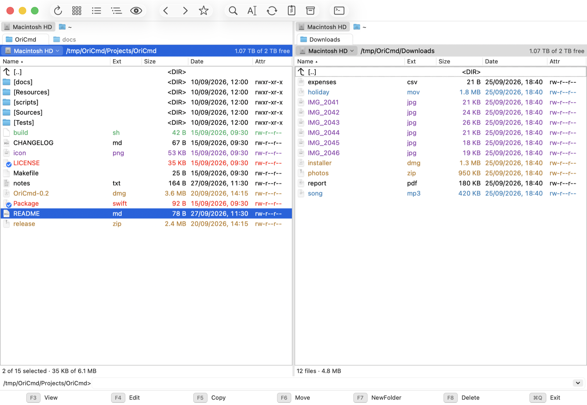
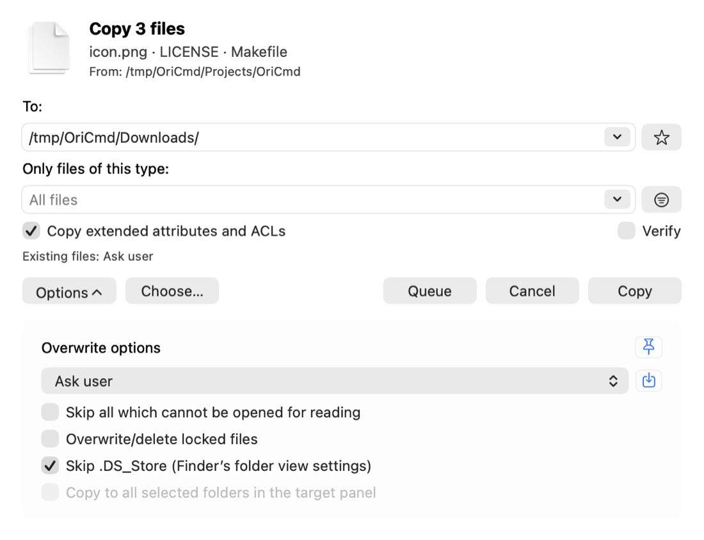
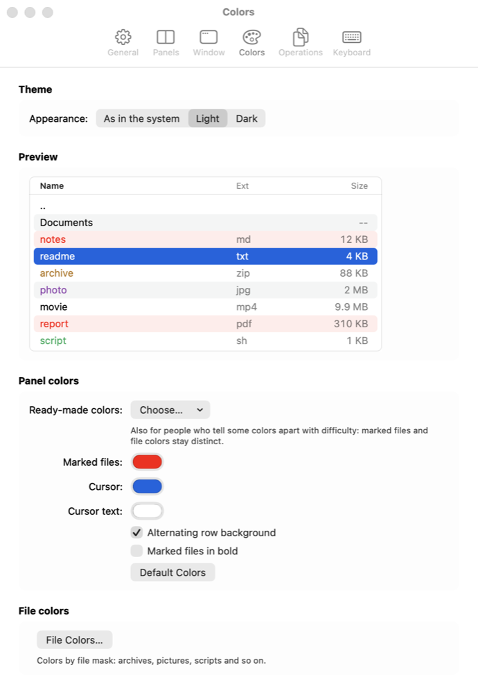
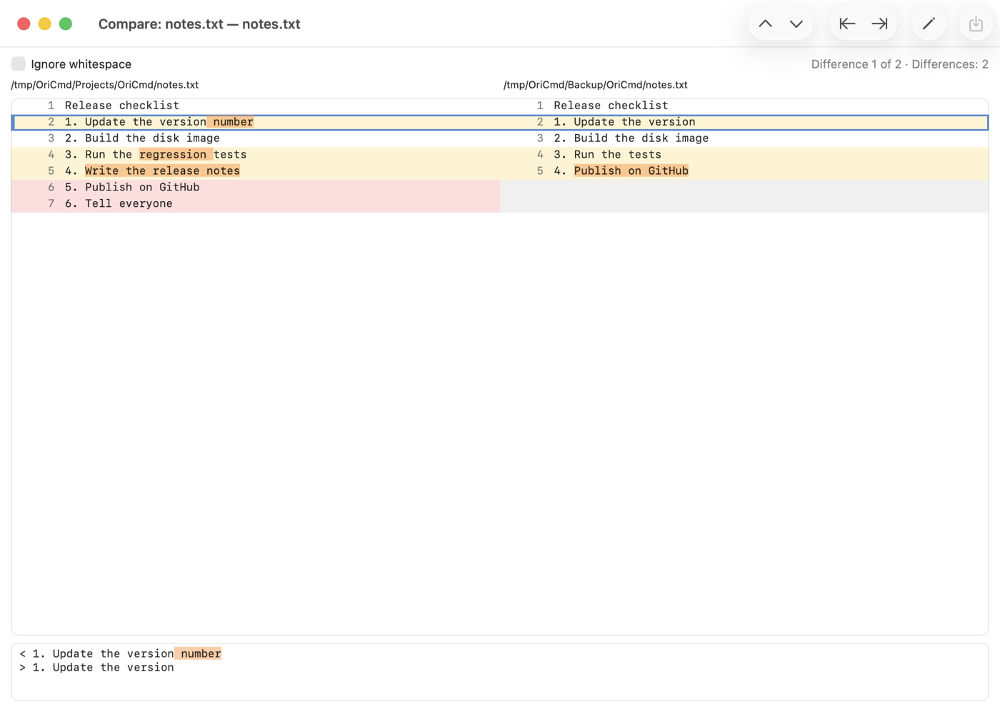
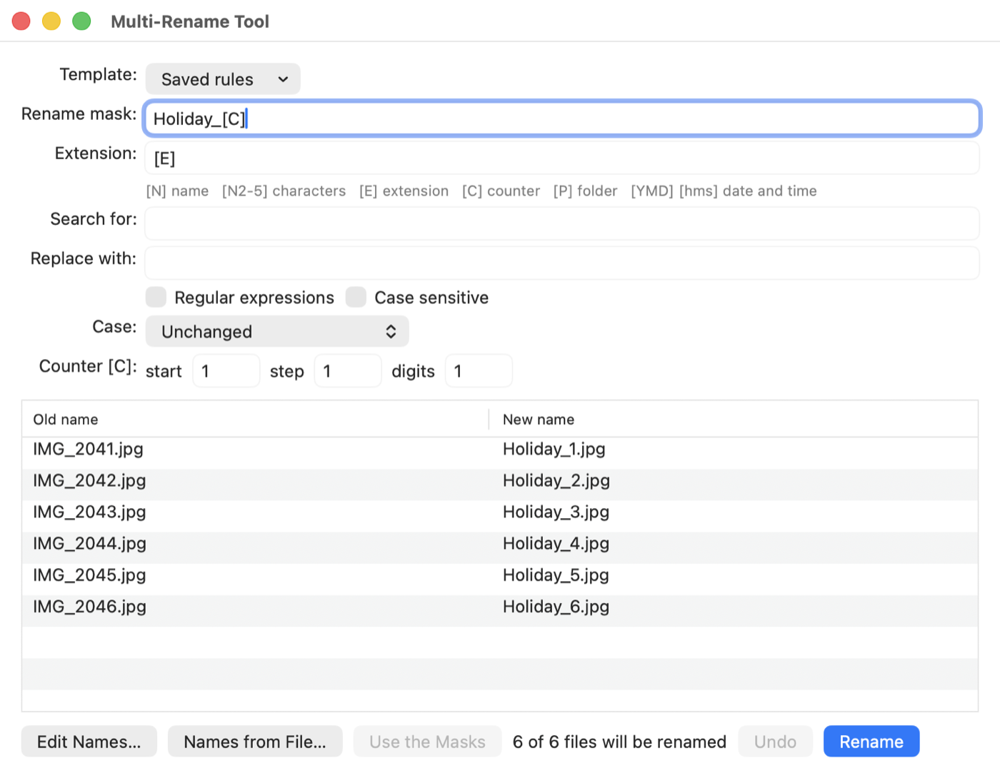
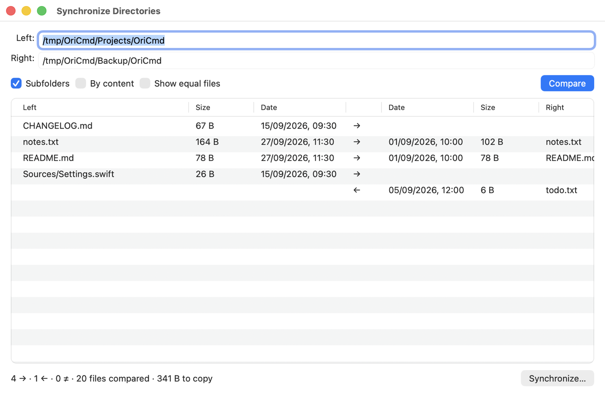
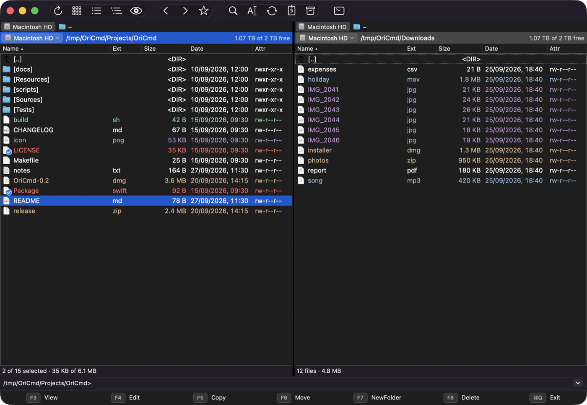

# OriCmd

**English** | [Русский](README.ru.md)

A two-panel file manager for macOS with a familiar look: two panels, function
key buttons at the bottom, a command line and full keyboard control — everything
in its usual place. The standard macOS shortcuts (`⌘C`, `⌘V`, `⌘Q`, `⌘W`, …)
keep working as always.



## Features

- **Panels:** tabs, history, directory hotlist, tree, filters, quick search, a
  clickable path (breadcrumbs) that is also editable with `Tab` completion; full and
  brief views, thumbnails, optional columns, file colors by mask and ready-made
  colors for color vision deficiencies.
- **Copy and move:** queue and background operations, file type filter, name
  masks, overwrite modes, verification after copying.
- **Archives as folders:** zip, tar, 7z and more — browse, extract, pack and
  change files right inside an archive; archives inside archives open too.
- **Servers in a panel:** SFTP (through the system ssh, with keys and
  passwords) with the server's terminal under the files, FTP/FTPS, saved and
  recent connections; smb, afp, NFS and WebDAV as volumes.
- **Tools:** viewer (`F3`) for text (UTF-8, UTF-16, Windows-1251, DOS, KOI8-R
  and other encodings) with syntax highlighting of code in about 190 languages,
  tables (Excel 2003 XML, HTML exports, CSV), e-books (FB2, EPUB, MOBI/AZW3,
  DjVu), hex and Quick Look (office documents too), compare files by content, synchronize directories, multi-rename, find
  files, checksums, attributes, the Finder's Get Info.
- **Make it yours:** your own keyboard shortcuts (including import from
  `wincmd.ini`), a Start menu, programs for `Enter`/`F3`/`F4` by file mask, a
  customizable button bar, the right mouse button marking files.
- Light and dark themes, English and Russian interface, automatic updates from GitHub.

## Screenshots

| | |
|---|---|
| <br>Copy (`F5`): file type filter, name masks, overwrite modes | <br>Settings with a panel preview |
| <br>Compare files by content | <br>Multi-Rename Tool (`Ctrl+M`) |
| <br>Synchronize directories | <br>Dark theme |

The screenshots are made by `scripts/screenshots.sh` on demo folders
(English ones in `docs/screenshots/en`, Russian ones in `docs/screenshots/ru`).

## Installation

With [Homebrew](https://brew.sh):

```sh
brew install --cask mmag/tap/oricmd
```

Or download the disk image from the [Releases](https://github.com/mmag/OriCmd/releases)
page. You can also build one yourself (a universal app for Apple Silicon and
Intel, macOS 14+):

```sh
scripts/make-dmg.sh        # → build/OriCmd-<version>.dmg
```

Open the image and drag OriCmd to Applications. The app is ad-hoc signed,
without an Apple certificate, so macOS won't open it the first time (whether it
came from Homebrew or from the image): right-click
OriCmd → Open → Open (or System Settings → Privacy & Security → Open Anyway).
Or remove the quarantine:

```sh
xattr -dr com.apple.quarantine /Applications/OriCmd.app
```

After that OriCmd updates itself: once a day (can be turned off in Settings) and
with OriCmd → Check for Updates… it looks for the latest release on GitHub,
downloads the image, replaces the app and relaunches. Updates are not
quarantined, so there is no need to allow the app again.

## Building

Requires macOS 14+ and Xcode.

```sh
xcodebuild -project OriCmd.xcodeproj -scheme OriCmd -configuration Debug build
```

The terminal is [SwiftTerm](https://github.com/migueldeicaza/SwiftTerm) (a Swift
package; Xcode fetches it on the first build). Syntax highlighting is
[highlight.js](https://highlightjs.org), kept in `Highlighter/` (the
`OriCmdHighlighter` XPC service, locked down, built with the app);
`scripts/update-highlightjs.sh <version>` takes another version from npm,
checking the package's checksum.

The icon is drawn by `swift scripts/make-icon.swift`.

## Keys

On a Mac the F keys control brightness, sound and so on by default. Press them
with `fn`, or turn on "Use F1, F2, etc. keys as standard function keys" in
System Settings → Keyboard.

Commands have internal names (`cm_Copy`, `cm_RenMov`, …) compatible with
`wincmd.ini`; all of them are in the menus. Shortcuts in parentheses are
additional Mac-style ones.

Shortcuts are bound to physical keys: with a Russian (or any other) keyboard
layout `Ctrl+D`, `Ctrl+B`, `Ctrl+U` etc. work just like with the English one.

### Panels and navigation

| Key | Action |
|---|---|
| `↑` `↓` `PgUp` `PgDn` `Home` `End` | Move the cursor |
| `Enter`, double-click (`⌘↓`) | Open a folder / open a file |
| `Backspace`, `Ctrl+PgUp` (`⌘↑`) | Parent folder |
| `Ctrl+PgDn` | Go inside a package (`.app` etc.); on a file, open it as an archive whatever its name (`.docx`, `.jar`, a zip named otherwise); a file that is no archive stays as it is, it is never started |
| `Tab` | Switch panels |
| `Alt+←` / `Alt+→` (`⌘[` / `⌘]`) | Back / forward in the folder history |
| `Alt+↓` | Recent folders |
| `Ctrl+Shift+←` / `Ctrl+Shift+→`, `Ctrl+←` / `Ctrl+→` (`⌥⌘←` / `⌥⌘→`) | Show in the left / right panel what is under the cursor: a folder's or an archive's contents, the folder of a file (with the file selected) |
| `Alt+F1` / `Alt+F2` | Volume list of the left / right panel |
| `Ctrl+\` | Root of the volume |
| `⌘T` / `⌘W` | New tab (or a double click on the empty part of the tab bar) / close tab |
| Dragging a tab | To another place of its bar, or onto the other panel's tabs: it moves there, with its server and terminal (a panel's only tab is copied) |
| `Ctrl+Tab` / `Ctrl+Shift+Tab` (`⇧⌘]` / `⇧⌘[`) | Next / previous tab |
| `Ctrl+↑` (`⌥⌘↑`) | Open the folder under the cursor in a new tab |
| `Ctrl+D` (`⌘D`) | Directory hotlist: go, add or remove the current folder |
| `Alt`+letter, `Ctrl+Alt`+letter | Quick search by name (`↑`/`↓` — other matches, a leading `*` searches inside names) |
| `Alt+F7` (`⌘F`) | Find files by mask and text; "Feed to Panel" shows the results as a list in the panel, where all commands work on them, `[..]` returns to the search folder |
| `Ctrl+F1` / `Ctrl+F2` (`⌘1` / `⌘2`) | Brief / Full view |
| `Ctrl+Shift+F1` (`⌘4`) | Thumbnails (Quick Look previews) |
| Right-click on the column headers | Optional columns: kind, date created, picture dimensions, duration, Finder tags (sortable like the others) |
| `Ctrl+F8` (`⌘3`) | Directory tree; the other panel shows the chosen folder |
| `Shift+F2` | Compare directories: mark unique and newer files in both panels |
| Commands → Synchronous Directory Changes | Entering a subfolder or going up in one panel is repeated in the other (if it has such a folder) |
| Commands → Synchronize Directories… | Compare two folders recursively and copy in the chosen directions (double-click or `Space` changes the direction) |
| `Ctrl+U` | Swap panels |
| Commands → Left = Right / Right = Left | Show the folder of one panel in the other |
| `⌘R` (`Ctrl+R`) | Reread the folder (changes are also picked up automatically) |
| `⇧⌘.` | Show / hide hidden files |
| `Ctrl+F3` … `Ctrl+F6` (`⌃⌥⌘1` … `⌃⌥⌘4`) | Sort by name, extension, date, size; again — reverse order. Clicking a column header does the same |

`Ctrl+F1`…`Ctrl+F8`, `Ctrl+↑` and `Ctrl+←/→` are taken by macOS by default
(focus on the Dock and the menu bar, Mission Control, switching Spaces). Turn
them off in System Settings → Keyboard → Keyboard Shortcuts, or use the
shortcuts in parentheses.

### Selection

| Key | Action |
|---|---|
| `Space`, `Insert` | Mark a file and move down; on a folder, also calculate its size |
| `Alt+Shift+Enter` | Calculate the size of all folders |
| `Shift+↑/↓`, `Shift+PgUp/PgDn/Home/End` | Mark a range |
| `⌘`-click, `Shift`-click | Mark with the mouse (or the right button, if it marks files: see Mouse) |
| `+` / `−` | Mark / unmark a group by mask (`*.txt;*.md`) |
| `*` | Invert the marking of files |
| `Num /` | Restore the previous selection |
| `⌘A` / `⌥⌘A` | Mark all / unmark all |
| `⌥+` / `⌥−` | Mark / unmark files with the extension of the one under the cursor |
| Show → Filter… | Show only files matching a mask (the mask is shown in the path bar) |
| `Ctrl+B` (`⌘B`) | Branch view: all files of the folder and its subfolders in one list |
| `Ctrl+S` | Quick filter: only names containing the typed text stay; `Enter` keeps the filter, `Esc` removes it |

### File operations

| Key | Action |
|---|---|
| `F3` | View (Lister): `1` text, `3` hex, `7` Quick Look (images, PDF, media and office documents — Word, Excel, PowerPoint, Pages, Numbers, Keynote, OpenDocument — open in it at once) or a table, an e-book, a web page, Markdown or a 3D model (see below), `W` word wrap; encodings: `8` UTF-8, `U` UTF-16, `A` Windows-1251, `S` DOS (866), `K` KOI8-R, all of them (and Automatically) in the text's context menu — the one used is in the title, kept for `N`/`P`; `H` syntax highlighting on/off, `F` formatting of JSON, XML and code (see below); `N`/`P` next/previous file, `F7`/`⌘F` find, `F3`/`⇧F3` find next/previous, `Esc` close |
| `F4` | Open in the default text editor (or the program from the associations) |
| `Shift+F4` | Create a new file and open it in the editor |
| `F5` | Copy (to the other panel by default) |
| `Shift+F5` | Copy within the same folder under another name |
| `F6` | Move / rename |
| `Shift+F6`, `F2` | Rename in place (the name is selected; `F2` again selects the extension, then the whole name) |
| `Ctrl+M` | Multi-Rename Tool: masks `[N]`, `[N2-5]`, `[E]`, `[C]`, `[P]`, `[YMD]`, `[hms]`, search and replace (including regular expressions), case, preview and undo |
| `F7` (`⇧⌘N`) | New folder (`a/b/c` creates nested ones) |
| `F8`, `Del` (`⌘⌫`) | Move to the Trash |
| `Shift+F8`, `Shift+Del`, `Shift+⌫`, `⇧⌘⌫`, `⌥⌘⌫` | Delete permanently, past the Trash (in the context menu, Delete becomes Delete Permanently while Shift is held) |
| `Ctrl+Shift+F5` | Create a symbolic link (in the other panel by default) |
| Files → Compare by Content | Two marked files, or the files under the cursors of both panels. The compare window aligns the lines: changed ones are yellow (with the differing part highlighted), removed ones red, added ones green; `N`/`P` (`⌥↓`/`⌥↑`) — next/previous difference, "Ignore whitespace"; binary files are compared byte by byte in hex |
| `⌘I` | Change attributes: rwx permissions, hidden, locked, modification date (also recursively) |
| `Alt+Enter` (`⌥↩`) | Get Info: the Finder's info windows of the selected files (of the folder shown on `[..]`) |
| `Ctrl+Q` | Quick View in the other panel |
| `Esc` | Close a dialog or a window in front (Cancel): copying, questions, Find Files, synchronization, settings |
| `⌘C` / `⌘X` / `⌘V` (`Ctrl+C` / `Ctrl+X` / `Ctrl+V`) | Copy / cut / paste files (compatible with Finder); pasting into the same folder creates "name copy". Files copied or dragged from Microsoft Remote Desktop, virtual machines or Mail (promised files) arrive with their real contents |
| `⌥⌘V` | Move the files from the clipboard here |
| `⌥⌘C` | Copy the full paths of the selected files (Mark → Copy Names — names only) |
| `⌘K` | Connect to a server: `sftp://`, `ftp://`, `ftps://`, `ftpes://` open right in the panel; smb, afp, nfs and WebDAV are mounted as volumes (with a "Connecting…" window you can cancel; a server that does not answer is reported within seconds). The last ten servers connected to are listed under the address: a click picks one, a double click connects, `−` removes one; the window can be made taller |
| `Ctrl+F` (`⇧⌘K`) | Saved connections (passwords are kept in the Keychain) |
| Net → Disconnect | Close the server in the active panel |
| `⌘E` | Eject the removable or network volume of the active panel |
| `Alt+F5` | Pack into an archive (the format follows the extension: `.zip`, `.tar.gz`, `.tar.bz2`, `.tar.xz`, `.7z`) |
| `Alt+F9` | Unpack the selected archives |
| Files → Create Checksum File… | MD5 / SHA-1 / SHA-256 / SHA-512 for the selection (`shasum`/`md5sum` format) |
| Files → Verify Checksums | Check the `.md5`/`.sha1`/`.sha256`/`.sha512` file under the cursor |

Long operations (copy, move, archives) show their progress; the "Background"
button moves it to a separate window so you can keep working with the panels.

#### E-books in the viewer

FB2 (also `.fb2.zip`), EPUB, MOBI, AZW, AZW3 and PRC books open to read: title and
author in the window title, chapters, epigraphs, verses, quotes, notes, lists,
emphasis, pictures and the cover, in a serif column in the middle of the window;
Contents in the context menu jumps to a chapter, `F7`/`⌘F` finds text, `1` shows
the file's text. Books protected by DRM are said so. DjVu documents show their
pages when DjVuLibre is installed (`brew install djvulibre`; its `ddjvu` draws
them in a sandbox that can read nothing but that file), and their hidden text
layer otherwise and with `F7`/`⌘F` (`7` shows the pages again). The books are read
by the same locked-down helper as syntax highlighting, pictures included, and what
it returns is checked.

#### Tables in the viewer

What Quick Look can't show as a table, the viewer can: Excel 2003 XML files (by
their contents, whatever the name: `.xlsx`, `.xls`, `.xml` — many programs export
them), HTML pages named `.xls`/`.xlsx` (another common export) and CSV/TSV (the
delimiter — `,` `;` tab — is found by itself). They open as a grid with column
letters and row numbers, the sheets to choose from above it; merged cells show
their value in the first one, dates as dates, numbers to the right. `⌘C` copies the
selected rows (tab-separated, as Excel and Numbers paste them), the encodings work
as for text, `1` shows the text and `7` the table again. The files are read by the
same locked-down helper as syntax highlighting, and what it returns is checked.

#### Web pages, Markdown and formatting in the viewer

HTML files open as pages and Markdown files as documents (tables, colored code,
task lists, pictures lying next to the file); `1` shows the source, `7` the page
again. Pages are shown locked: JavaScript is off, nothing is loaded from the
network (not even a picture, so a page can't tell anyone it was opened), only
files of the page's folder and its subfolders show in it, and a link opens in the
browser only when clicked. Markdown is made into a page by
[markdown-it](https://github.com/markdown-it/markdown-it) in the same locked-down
helper as syntax highlighting.

`F` (or Format in the context menu) lays out JSON, XML, JavaScript, TypeScript, CSS
and HTML for reading, and stays on for the next files: JSON and XML by OriCmd
itself (comments, the order of keys and broken files kept),
JavaScript, CSS and HTML by [js-beautify](https://github.com/beautifier/js-beautify),
TypeScript by [Prettier](https://prettier.io), in the locked-down helper too.

#### 3D models in the viewer

STL files (binary or text) open as a model to turn with the mouse: drag to turn
it, the wheel or a pinch to come nearer, Option-drag or two fingers to move it, a
double click to see it as at first; its size and number of triangles are in the
window title. The file is read by the same locked-down helper as syntax
highlighting, and what it returns is checked.

#### Syntax highlighting in the viewer

The viewer colors program code with [highlight.js](https://highlightjs.org)
(about 190 languages). The language follows the file's extension or name
(`Makefile`, `Dockerfile`, `.zshrc`), or the program on its `#!` line (assembly by
its instructions: x86, ARM, MIPS, AVR); texts up to about 512 thousand characters
are highlighted, the context menu and `H` turn it on and off. highlight.js runs in
a separate helper, `OriCmdHighlighter`, which locks itself down before it reads
anything from OriCmd: no files (not even system ones), no network, no pasteboard,
no opening of URLs, no starting or signalling other programs, no looking up other
services (the preferences daemon it met while starting checks the lockdown too).
Only texts in a language highlight.js knows are sent to it, never key, certificate
or signature files. A file made to attack the JavaScript engine could at most see
the texts shown in the viewer afterwards, see which programs run, post system
notifications, take up shared memory until a restart and send back a wrong
coloring, which OriCmd checks; nothing can leave the Mac through it. A highlighting
that takes more than 5 seconds is stopped (the text stays plain).

#### The copy and move dialog (`F5` / `F6`)

- **Target** with a name mask: `folder/*.*` keeps the names, `folder/*.bak`
  changes the extension, `folder/new_*.*` adds a prefix; without a mask and for a
  single file it is the new name. The drop-down list holds the target list and
  recent paths; `F7` (the "+ F7" button) adds the current folder to the target
  list or removes it, `⌃D` picks a folder from the directory hotlist, "Tree"
  chooses a folder.
- **Only files of this type:** `*.jpg *.png` copies only such files (in
  subfolders too); exclusions come after `|`: `*.* | *.bak .git/ node_modules/`;
  a name ending in `/` is a folder at any depth (`src/` — only the `src` folders,
  with everything inside). Folders left empty by the filter are not created.
  `F8` (the "+ F8" button) — saved filters and examples.
- **Copy extended attributes and ACLs** (tags, Finder comments, access
  rights); **Verify** compares every copied file with the original.
- Buttons: **OK** (`Return`), **F2 Queue** — the operation joins the queue and
  runs one at a time in its own progress window, **Tree**, **Cancel** (`Esc`),
  **Options >>**. Right-click OK or F2 Queue to move instead of copying (and the
  other way round).
- **Options >>**: overwrite mode (ask, overwrite all, skip all, overwrite older,
  auto-rename the copied or the existing files — `name(2).ext`, copy larger or
  smaller ones), skip unreadable files, overwrite/delete locked files, copy to all
  folders selected in the target panel. The pin keeps the options open, the save
  button makes them the default.

### Archives

`Enter` or `Ctrl+PgDn` on an archive (zip, tar.\*, 7z, rar, iso, cab, …) opens
it like a folder. Inside it navigation, selection, `F3`, `Enter` (the file is
extracted to a temporary folder and opened) and `F5` (extract the selection to
the other panel) work. Zip, tar, tar.gz, tar.bz2, tar.xz and 7z archives can
also be written: `F5`/`F6` into a panel showing an archive pack the files into
it, and `F7`, `F8` and `Shift+F6` work inside (the archive is rebuilt through a
temporary folder). rar, iso, cab and others are read-only. An archive inside an
archive opens the same way (`Enter`, `Ctrl+PgDn`; `[..]` goes back to the outer one);
it is read-only.

### Button bar and drive buttons

Under the window title there is a button bar with frequent commands (reread,
views, history, hotlist, find, multi-rename, synchronize, archives, Terminal).
Right-click it → Customize Toolbar… to change it. Applications can go on it too:
drag an `.app` from Finder or from a panel onto the button bar (or right-click an
application → Add to Button Bar). A click on its button starts the application,
files dropped on the button open in it; right-click for Show in Finder and Remove
from Button Bar. Above each panel there are
drive buttons: the startup volume, the home folder and mounted volumes (can be
hidden in Settings). Right-click a drive button for the Finder's volume menu: open
(also in a new tab or the other panel), eject a disk or a disk image, rename, Get
Info. When the buttons do not fit, they scroll (wheel, trackpad, arrows at the ends).

### Servers (SFTP, FTP)

SFTP works through the system `ssh`/`sftp`: `~/.ssh/config` (aliases,
ProxyJump), keys and ssh-agent are used; there is one shared connection per
server, and a password or passphrase is asked for once. FTP/FTPS goes through the
system `curl`. On a server navigation, `F3`, `Enter`, `F5`/`F6` both ways
(download/upload), `F7`, `F8`, `Shift+F6`, paste from the clipboard and dropping
files onto the server panel work. Transfers go file by file with byte progress
(current file and total). SFTP keeps permissions and dates of files and folders,
FTP keeps the dates of downloaded files.

#### Server terminal

An SFTP panel is split in two: the files on top, the server's shell below, opened
in the panel's folder over the same connection (nothing is asked again). Drag
the line above the terminal to resize it.

| Key | Action |
|---|---|
| `` ⌃` `` | Go to the terminal (showing it); in the terminal, hide it and go back to the files |
| `` ⌃⌥` `` | Go to the panel's folder in the terminal (at the shell's prompt: what is typed there is cleared first) |

The keys are tied to the key that types `` ` `` on the Latin layout, on any
layout; on ISO keyboards the key under `Esc` (`§`, `ё` on Russian – PC) works
too. While the terminal has the focus, every key without `⌘` goes to the
shell — `Tab`, `Esc`, the function keys, `⌃C`; `⌘C`/`⌘V` copy and paste. When
you go back to the files, the server folder is read again. After `exit`,
`Return` connects again. OriCmd remembers whether you hid the terminal and
opens the next connection the same way.

A server lives in its tab: switching tabs keeps the connection and the shell
(a command keeps running). A server tab is not duplicated: a drive button there
opens the drive in a new tab, and `⌘T` opens the local folder the tab came from.
The terminal ends when you leave the server in its tab, disconnect, close the
tab or quit; if a program is still running there (OriCmd asks the server), you
are asked first. Disconnect keeps the connection while another tab (or the
other panel) shows the same server.

### Mouse

Right-click (or `Ctrl`-click) opens the context menu: open, open with, view,
show in Finder, clipboard, rename, delete, pack, Get Info (the Finder's window),
and the system Services. Files can be dragged between the panels, from Finder
and to Finder; copying by default, moving with `⌘`. Dropping onto a folder row
puts the files into it.

The right button can mark files instead (Settings → Panels → Mouse): a click
marks or unmarks a file, a drag over files makes them all as the first one
became, and holding the button still for half a second opens the context menu.
On `[..]`, on empty space and with `Ctrl`-click the menu opens at once.

The path above a panel works as breadcrumbs: a click on a parent folder in it goes
there, with the cursor on the folder you came from (in archives and on servers too).
When the path is too long, its start gives way to `…`, which lists the folders left
out.

A click on the current folder, the mask or right of the path makes it editable:
type a folder (or a file: it is shown selected; an archive opens), a folder on the
server or in the archive shown, or another server's address, and press `Enter`;
`Esc` cancels. `Tab` completes names, as in a shell; pressed again it goes through
the choices (`Shift+Tab` back).

### Command line

Letters typed in a panel go to the command line while the cursor stays in the
panel.

| Key | Action |
|---|---|
| `Enter` | Run the command in the current folder (login shell, no window) |
| `Shift+Enter` | Run in Terminal, the window stays open |
| `cd <path>`, a folder path | Change the folder of the active panel |
| `Ctrl+Enter` / `Ctrl+Shift+Enter` | Insert the name / full path of the file under the cursor |
| `Esc` | Clear the command line |

## Colors

Settings → Colors: the theme — as in the system, light or dark (for OriCmd only,
switches at once); the color of marked files, the cursor and the cursor text,
alternating row backgrounds; the panel preview shows the result right away.
File Colors… colors names by mask (archives, pictures, scripts — examples
included); in the dark theme these colors are shown lighter, so they stay readable.

Ready-made colors set the marked files' color and the file colors at once:
standard, for red–green color blindness (protanopia, deuteranopia; Okabe–Ito
colors), for blue–yellow color blindness (tritanopia), and high contrast. "Marked
files in bold" makes marking independent of color; the presets other than the
standard one turn it on. High contrast also stripes the rows; another preset takes
those stripes away again (not ones you turned on yourself).

## Your own keys

Settings → Keyboard → Keyboard Shortcuts…: any `cm_*` command can get its own
shortcut (double-click a row and press the keys). The "Import wincmd.ini…"
button takes the assignments from the `[Shortcuts]` section of a `wincmd.ini`
file — they are added to the standard keys.

## Start menu

Your own commands: Start → Change Start Menu…. A command runs in the shell in the
folder of the active panel; the parameters `%P` (folder of the active panel),
`%N` (file under the cursor), `%S` (selected files), `%T` / `%M` (folder and
file under the cursor in the other panel) are inserted already quoted. A command
can have its own shortcut (`CM+E` is ⌃⌘E) and run in Terminal; Customize
Toolbar… puts commands on the button bar.

## Internal associations

Files → Internal Associations… (or the button in Settings): for a mask
(`*.swift;*.json`) you choose programs for `Enter`, `F3` and `F4`. A program is
an application (the Application… button) or a shell command: `%P` is the file's
folder, `%N` its name; without parameters the path is added at the end
(`code -g`, `qlmanage -p`). The first matching entry with a program for that key
wins; otherwise the standard behavior applies. A `*` mask at the end of the list
sets a program for all other files.

## Settings

OriCmd → Settings… (`⌘,`) — a window with panes:

- **General** — interface language, automatic update checks.
- **Panels** — panel preview, font, command line, function key and drive
  buttons, button bar setup, what the right mouse button does.
- **Colors** — light or dark theme (or as in the system), panel preview,
  ready-made colors, colors of marked files (and bold) and the cursor,
  alternating rows, colors by file mask.
- **Operations** — defaults of the copy dialog (overwrite mode, verification,
  attributes), confirmation of moving to the Trash, internal associations,
  Start menu.
- **Keyboard** — quick search mode, your own shortcuts, a note about the F keys
  on a Mac.

## Interface language

English and Russian. By default the system language is used; Settings → General
chooses the language for OriCmd only (the Restart Now button applies it at once).

## Development

A Debug build can play key scenarios and save window snapshots — see
`OriCmd/App/DebugAutomation.swift`. The scenarios only work on explicitly given
test folders (`ORICMD_LEFT`, `ORICMD_RIGHT`); `scripts/test/` has the test data,
the regression suite and local test servers.

Release: `scripts/release.sh 0.2 [notes.md]` sets the version, builds the disk
image, commits, tags `v0.2`, pushes to GitHub, publishes the release with the
image and updates the Homebrew cask in `mmag/homebrew-tap` (needs `gh auth login`).

## License

GPL-3.0 — see [LICENSE](LICENSE). The terminal uses
[SwiftTerm](https://github.com/migueldeicaza/SwiftTerm) (MIT License), syntax
highlighting [highlight.js](https://highlightjs.org) (BSD 3-Clause License); DjVu
text layers are decompressed as [DjVuLibre](https://djvu.sourceforge.net) does
(GPL-2.0-or-later, used under version 3); their notices are in About OriCmd.

OriCmd is not affiliated with Ghisler Software GmbH. Total Commander is a
trademark of its owner.
